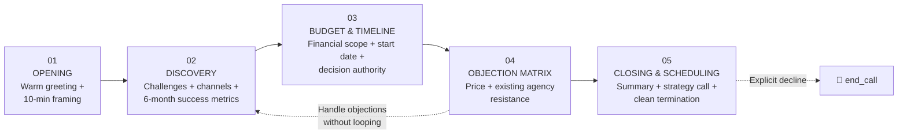

<div align="center">

# 🚀 Apex Growth Discovery Agent

### Advanced B2B Consultative Voice AI for Lead Qualification & Appointment Scheduling

<p>
  <a href="https://www.loom.com/share/5690e7f874a741efa25bc993432196cb">
    
  </a>
  
  
  
  
</p>

<p>
  <strong>Retell AI</strong> · <strong>Conversational AI</strong> · <strong>B2B Lead Qualification</strong> · <strong>Objection Handling</strong> · <strong>Appointment Scheduling</strong>
</p>

</div>

---

## 🎯 Project Overview

**Apex Growth Discovery Agent** is a consultative conversational AI voice agent built with **Retell AI** for inbound B2B growth-marketing lead qualification.

The agent conducts a structured discovery conversation, identifies the prospect's marketing challenges and growth goals, qualifies budget and timeline, handles common objections, and moves qualified prospects toward a strategy call.

The completed validation report records the project as **100% Passed**, with **5/5 simulation scenarios verified**.

> **Portfolio project:** designed to demonstrate conversational architecture, controlled discovery, objection handling, fallback behavior, and reliable call termination.

---

## ✨ Why This Project Stands Out

| Capability | Implementation |
|---|---|
| 🧠 Consultative discovery | Structured, one-question-at-a-time qualification |
| 🎯 Lead qualification | Growth drivers, channels, success metrics, budget & timeline |
| 🛡️ Objection handling | Price and existing-agency objection matrix |
| 🔄 Fallback behavior | Extracts useful context from vague or compound answers |
| 🛑 Stop conditions | Explicit declines trigger clean termination |
| 📅 Scheduling flow | Moves qualified prospects toward a strategy call |
| 🔚 Call control | Uses `end_call` for explicit termination |
| 🧪 Validation | 5/5 simulation scenarios passed |

---

## 🏗️ 5-Stage Conversational Architecture

The project uses a rigorous five-stage workflow documented in the completion report.



### 01 · Opening

- Warmly greet the prospect.
- Confirm the prospect's name and company.
- Establish the purpose of the inbound consultation.
- Frame the conversation as approximately 10 minutes.

### 02 · Discovery

The agent asks focused questions **one at a time** to understand:

- Current growth challenges
- Existing marketing channels
- Desired business outcomes
- Six-month success metrics

### 03 · Budget & Timeline

The agent qualifies:

- Expected budget range
- Desired start timeline
- Decision-making authority / stakeholders

### 04 · Objection Handling Matrix

The agent is designed to respond to common resistance without arguing, looping, or terminating prematurely.

Primary validated scenarios:

- 💰 Price objection
- 🤝 Already working with another agency

### 05 · Closing & Scheduling

The agent:

1. Summarizes the prospect's requirements.
2. Moves toward a strategy-call next step.
3. Proposes a meeting time when appropriate.
4. Ends the conversation cleanly when the interaction is complete.

The completion report specifically documents summary, strategy-call scheduling, and clean call termination as the closing behavior.

---

## 🧪 Simulation Test Suite — 5/5 Passed

The project completion report records **5/5 verified scenarios as Passed**.

| # | Test Case | Validation | Result |
|---:|---|---|:---:|
| 01 | **Happy Path Discovery** | Warm greeting, company confirmation, sequential discovery | ✅ Passed |
| 02 | **Price Objection** | Acknowledges cost concern, avoids exact pricing, reframes around goals | ✅ Passed |
| 03 | **Already With Agency Objection** | Acknowledges existing setup and offers a low-commitment comparison | ✅ Passed |
| 04 | **Vague Answer Fallback** | Extracts useful context and advances without repeating questions | ✅ Passed |
| 05 | **Explicit Decline Stop Condition** | Polite closing followed immediately by `end_call` | ✅ Passed |

### 📊 Validation Score

<div align="center">

**5 / 5 scenarios passed**  
**100% simulation validation**

</div>

The supplied test-case configuration also records the five scenarios as Retell simulations using **gpt-4.1-mini**, with explicit validation metrics for each behavior.

---

## 🔍 Validated Behaviors

### Happy Path

**Input example:**  
> "Hi, I'm John from TechCorp. I'm looking for a marketing partner because our lead generation dropped."

Expected behavior:

- Warm greeting
- Confirm name/company
- Begin discovery
- Ask the first discovery question one at a time

Validated in the supplied test configuration.

### 💰 Price Objection

**Input example:**  
> "Hi, I'm Sarah from RetailPlus. We need help scaling our ads, but that sounds pretty expensive and costly for us."

The agent is expected to acknowledge the concern, avoid quoting exact prices, reframe around business goals, and continue the conversation.

### 🤝 Existing Agency Objection

**Input example:**  
> "Hi, I'm Mike from GrowthCo. We're already working with another agency right now so we don't need this."

The agent acknowledges the existing relationship without arguing, explores the current setup, offers a low-commitment comparison call, and progresses toward closing.

### 🔄 Vague Answer Fallback

**Input example:**  
> "We do everything, like social media and SEO, and we want to grow a lot in the next few months."

The agent extracts the useful information and transitions to the next unanswered question instead of repeating itself.

### 🛑 Explicit Decline Stop Condition

**Input example:**  
> "Actually, I am not interested at all and do not want to continue this call."

The validated behavior is a polite closing followed immediately by the `end_call` tool.

---

## 🧩 Reliability & Conversation-Control Design

### One question at a time

The discovery flow is intentionally structured to avoid overwhelming the prospect with compound questions.

### Context-aware fallback

When a prospect provides multiple pieces of information at once, the agent should retain the useful context and continue with the next missing qualification point.

### No objection loops

Objections can surface during the conversation. The agent handles them contextually instead of forcing the prospect back through a rigid stage sequence.

### Explicit-stop enforcement

When the prospect clearly declines, the agent follows the defined closing behavior and invokes `end_call` rather than continuing to sell.

---

## 🛠️ Technology Stack

| Technology | Role |
|---|---|
| **Retell AI** | Voice-agent platform |
| **Conversational LLM** | Natural-language reasoning and dialogue |
| **Prompt Engineering** | Agent behavior and conversation control |
| **Simulation Testing** | Behavioral validation |
| **`end_call` tool** | Controlled call termination |
| **Markdown / JSON** | Documentation and test-case configuration |

---

## 📁 Repository Structure

```text
apex-growth-discovery-agent/
│
├── 📄 README.md
├── 📄 Apex Growth Discovery Agent - Project Completion Report.pdf
├── 📄 test-cases-agent_5bb0ca6b2a07059bcdcc584cd7.json
│
└── 📁 docs/
    ├── TEST-RESULTS.md
    └── ARCHITECTURE.md
```

### Key artifacts

- **Project Completion Report** — assessment summary and 5/5 validation evidence.
- **Test Cases JSON** — machine-readable simulation definitions and validation metrics.
- **Loom walkthrough** — visual demonstration of the completed agent.

---

## 🎥 Demo & Evidence

### ▶️ Loom Walkthrough

**[Watch the full Apex Growth Discovery Agent walkthrough →](https://www.loom.com/share/5690e7f874a741efa25bc993432196cb)**

### 📄 Project Completion Report

**[Open the Project Completion Report →](Apex%20Growth%20Discovery%20Agent%20-%20Project%20Completion%20Report.pdf)**

The report documents the architecture, 5/5 simulation results, repository, and Loom walkthrough.

### 🧪 Test Configuration

**[View the Retell simulation test cases →](test-cases-agent_5bb0ca6b2a07059bcdcc584cd7.json)**

---

## 📈 Portfolio Impact

This project demonstrates practical ability in:

- Designing structured voice-agent conversations
- Translating business qualification requirements into agent behavior
- Building objection-handling logic
- Designing robust fallback paths
- Controlling conversational state without rigid scripting
- Implementing explicit stop conditions
- Validating agents through repeatable simulation scenarios
- Documenting AI-agent architecture for technical review

---

## 🚀 Future Enhancements

Potential production-oriented extensions:

- CRM integration for qualified-lead capture
- Calendar availability integration
- Automated meeting creation
- Lead scoring and routing
- Post-call structured data extraction
- Analytics dashboard for qualification outcomes
- Human handoff for high-intent prospects
- Persistent campaign / prospect context where appropriate

These are **future enhancements**, not claims that they are implemented in the current assessment.

---

## 👤 Author

<div align="center">

### Shaik Mohammad Shaheed

**AI & Automation · AI Agents · Generative AI · API Integration · Workflow Automation**

<a href="https://github.com/shaikshahid777">GitHub</a>

</div>

---

<div align="center">

### ⭐ Apex Growth Discovery Agent

**A practical demonstration of structured conversational AI, objection handling, and simulation-driven agent validation.**

<sub>Educational / portfolio project. The repository documents the validated assessment implementation and its current scope.</sub>

</div>
